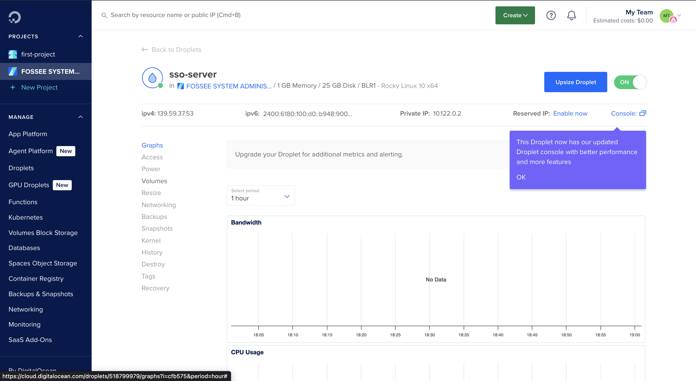
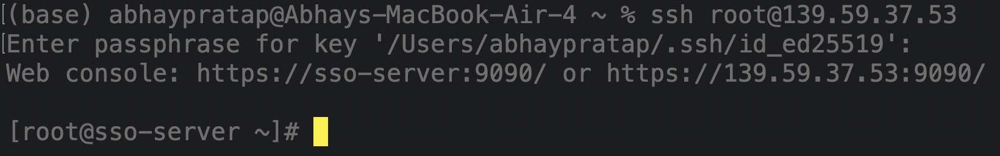
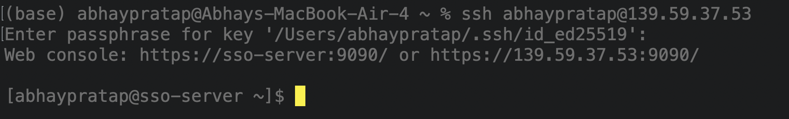
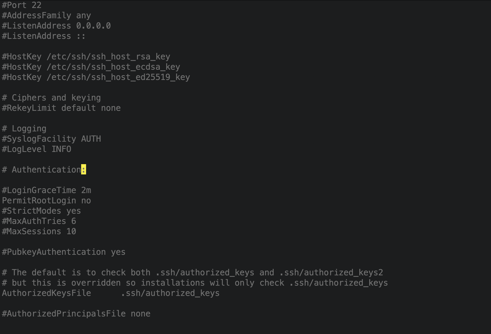
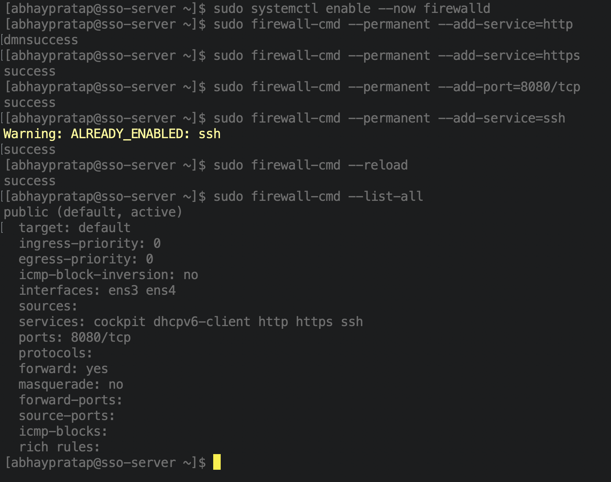
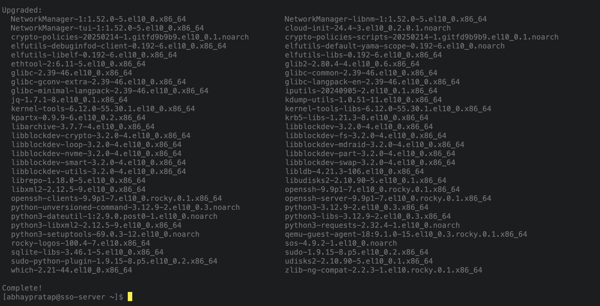
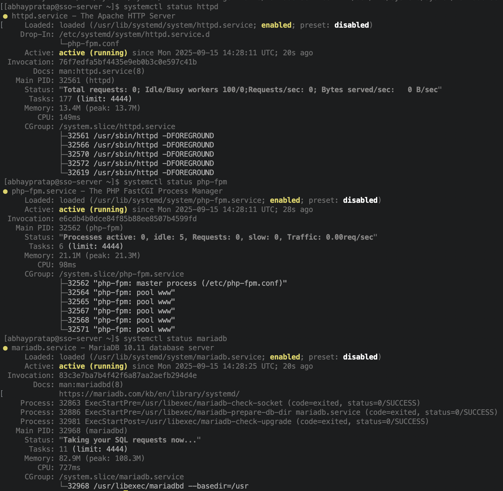

# Step 1: Server Setup (Rocky Linux Droplet)

This document covers the **creation and hardening** of a Rocky Linux 10 server on DigitalOcean for hosting Keycloak and applications.

## 1. Create Droplet

- Logged into [DigitalOcean dashboard](https://cloud.digitalocean.com/droplets).
- Datacenter: Bengaluru
- Selected **Rocky Linux 10**, Basic $6/month plan, IPv4 + IPv6 enabled.
- Added my **SSH public key** for authentication.
- Named droplet `sso-server`.



## 2. Initial Login (root)

Connected to new Droplet as the root user.

```bash
ssh root@139.59.37.53
```



## 3. Created a New User

For security and best practise, created a new user and grant administrative privileges.

```bash
adduser abhaypratap
passwd abhaypratap

usermod -aG wheel abhaypratap
```

Configure SSH for New User

```bash
rsync --archive --chown=abhaypratap:abhaypratap ~/.ssh /home/abhaypratap
```

Login as New User

```bash
ssh abhaypratap@139.59.37.53
```



## 4. Disable Root Login

Edit SSH config:

```bash
vim /etc/ssh/sshd_config
```

Changed `PermitRootLogin yes` to `PermitRootLogin no`



Restart SSH:

```bash
sudo systemctl restart sshd
```

## 5. Enable Firewall (firewalld)

Installed and enabled firewall:

```bash
sudo dnf install firewalld -y
sudo systemctl enable --now firewalld
```

Allow services:

```bash
sudo firewall-cmd --permanent --add-service=http
sudo firewall-cmd --permanent --add-service=https
sudo firewall-cmd --permanent --add-port=8080/tcp
sudo firewall-cmd --permanent --add-service=ssh
```

Apply the new rules

```bash
sudo firewall-cmd --reload
```



## 6. Update System & Install Core Components

```bash
# Update all system packages
sudo dnf update -y

# Install EPEL and Remi repositories for up-to-date packages
sudo dnf install epel-release -y
sudo dnf install https://rpms.remirepo.net/enterprise/remi-release-10.rpm -y
sudo dnf module enable php:remi-8.3 -y

# Install Apache, PHP, MariaDB, Python, and other tools
sudo dnf install httpd php php-cli php-mysqlnd php-gd php-xml php-mbstring php-json php-fpm mariadb-server python3 python3-pip unzip wget -y

# Enable and start core services
sudo systemctl enable --now httpd
sudo systemctl enable --now php-fpm
sudo systemctl enable --now mariadb

#Check status:
systemctl status httpd
systemctl status php-fpm
systemctl status mariadb

# Secure your database installation
sudo mysql_secure_installation
```




