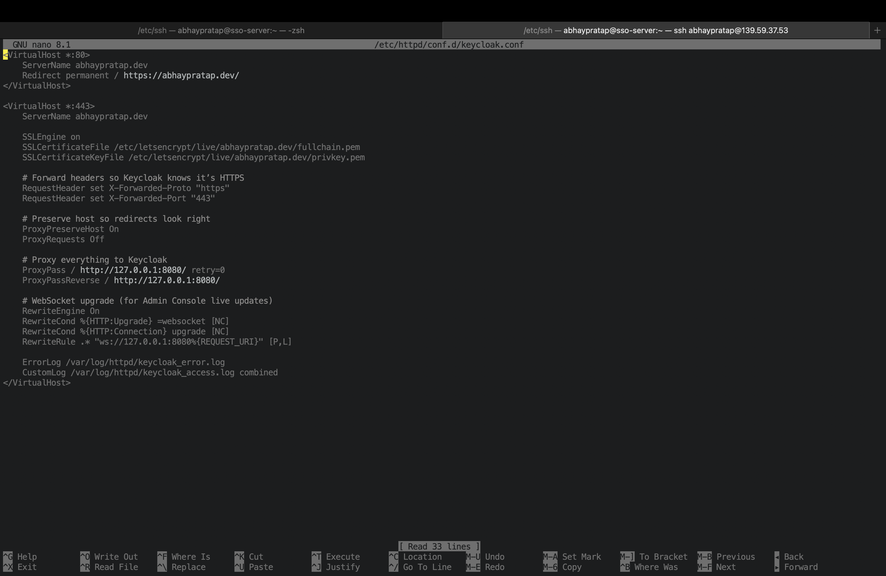

# Step 2: Keycloak Installation & Configuration

This document covers how to set up Keycloak for production, including reverse proxy with Apache, SSL, and MariaDB integration.

## 1. Prerequisites

- Linux server (Rocky Linux 10)
- Apache installed with SSL support (mod_proxy, mod_ssl)
- Domain pointing to server (https://abhaypratap.dev)

## 2. Install Java

Keycloak 21+ requires Java 17+. Rocky Linux 10 does not provide Java 17 in default repos, so we install Java 21:

```bash
sudo dnf install java-21-openjdk java-21-openjdk-devel -y
```

## 3. Install Keycloak

Download Keycloak and extract to /opt/keycloak

```bash
cd /opt
sudo curl -L -o keycloak.zip https://github.com/keycloak/keycloak/releases/download/21.1.1/keycloak-21.1.1.zip
sudo unzip keycloak.zip
sudo mv keycloak-21.1.1 keycloak
sudo chown -R keycloak:keycloak keycloak
```

## 4. Configure Apache Reverse Proxy with SSL

Apache Virtual Host

```apache
<VirtualHost *:80>
    ServerName abhaypratap.dev
    Redirect permanent / https://abhaypratap.dev/
</VirtualHost>

<VirtualHost *:443>
    ServerName abhaypratap.dev

    SSLEngine on
    SSLCertificateFile /etc/letsencrypt/live/abhaypratap.dev/fullchain.pem
    SSLCertificateKeyFile /etc/letsencrypt/live/abhaypratap.dev/privkey.pem

    RequestHeader set X-Forwarded-Proto "https"
    RequestHeader set X-Forwarded-Port "443"

    ProxyPreserveHost On
    ProxyRequests Off

    ProxyPass / http://127.0.0.1:8080/
    ProxyPassReverse / http://127.0.0.1:8080/

    RewriteEngine On
    RewriteCond %{HTTP:Upgrade} =websocket [NC]
    RewriteCond %{HTTP:Connection} upgrade [NC]
    RewriteRule .* "ws://127.0.0.1:8080%{REQUEST_URI}" [P,L]

    ErrorLog /var/log/httpd/keycloak_error.log
    CustomLog /var/log/httpd/keycloak_access.log combined
</VirtualHost>
```



## 5. Systemd Service for Keycloak

Create /etc/systemd/system/keycloak.service

```ini
[Unit]
Description=Keycloak Authorization Server
After=network.target

[Service]
Type=simple
User=keycloak
Group=keycloak
Environment="KEYCLOAK_ADMIN=admin"
Environment="KEYCLOAK_ADMIN_PASSWORD=<confidential>"
Environment="KC_DB=mariadb"
Environment="KC_DB_URL_HOST=localhost"
Environment="KC_DB_URL_DATABASE=keycloak"
Environment="KC_DB_USERNAME=keycloak"
Environment="KC_DB_PASSWORD=<confidential>"
Environment="KC_DB_POOL_INITIAL_SIZE=5"
Environment="KC_DB_POOL_MAX_SIZE=20"
ExecStart=/opt/keycloak/bin/kc.sh start \
  --http-port=8080 \
  --http-host=0.0.0.0 \
  --hostname=abhaypratap.dev \
  --proxy=edge
LimitNOFILE=102400
LimitNPROC=102400
TimeoutStartSec=600
Restart=on-failure
RestartSec=30

[Install]
WantedBy=multi-user.target
```

Reload and enable systemd:

```bash
sudo systemctl daemon-reload
sudo systemctl enable keycloak
sudo systemctl start keycloak
sudo systemctl status keycloak
```


## 6. MariaDB Setup for Keycloak

Create database and user

```bash
CREATE DATABASE keycloak CHARACTER SET utf8mb4 COLLATE utf8mb4_unicode_ci;
CREATE USER 'keycloak'@'localhost' IDENTIFIED BY '<confidential>';
GRANT ALL PRIVILEGES ON keycloak.* TO 'keycloak'@'localhost';
FLUSH PRIVILEGES;
```

Download MariaDB JDBC driver

```bash
sudo mkdir -p /opt/keycloak/providers
sudo curl -L -o /opt/keycloak/providers/mariadb-java-client.jar https://repo1.maven.org/maven2/org/mariadb/jdbc/mariadb-java-client/3.1.4/mariadb-java-client-3.1.4.jar
```


## 7. Keycloak Production Startup

Start Keycloak:

```bash
sudo systemctl restart keycloak
```

Admin Console: `https://abhaypratap.dev/`


