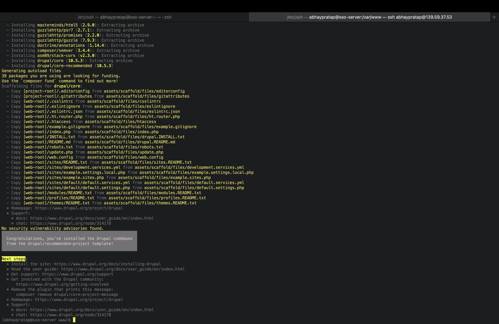
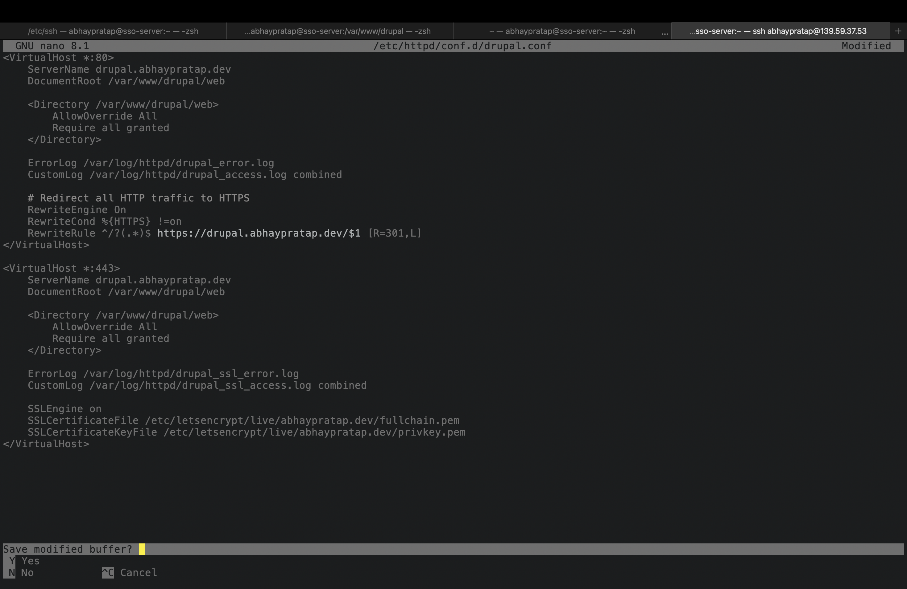
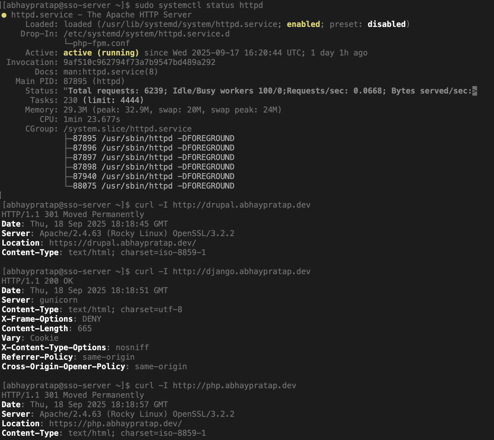
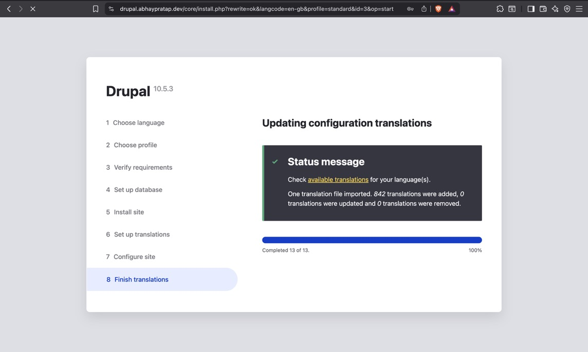
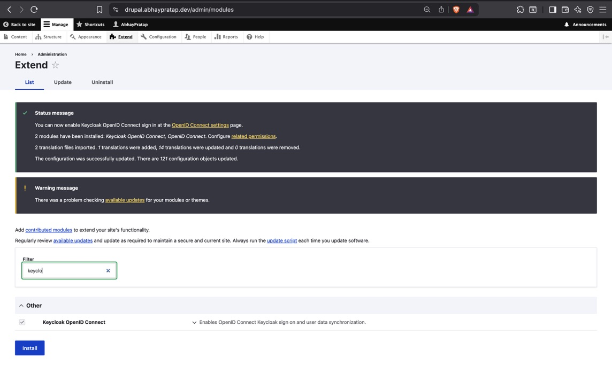
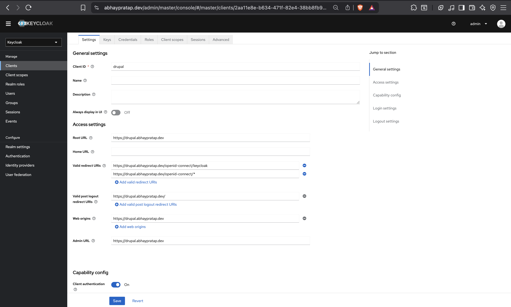
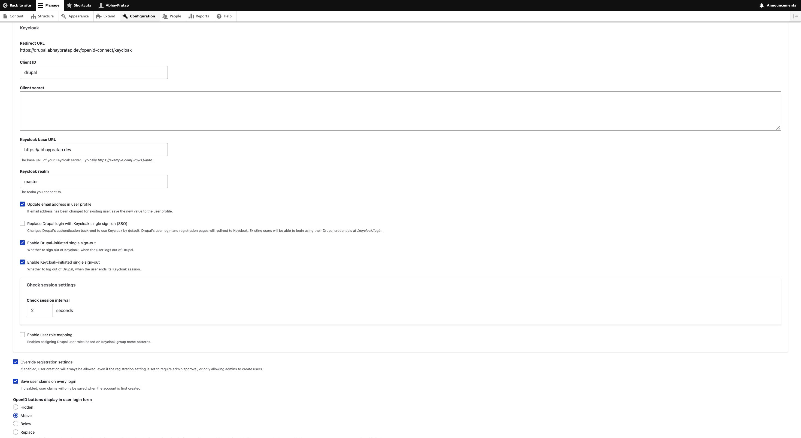
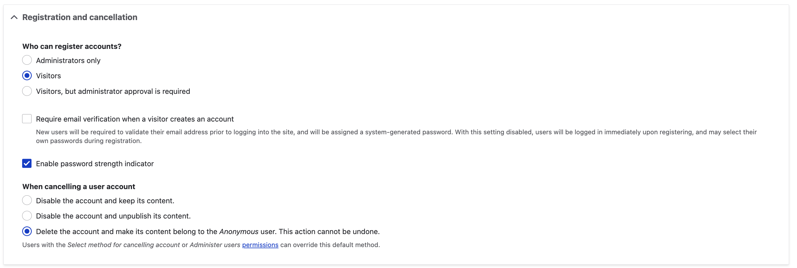
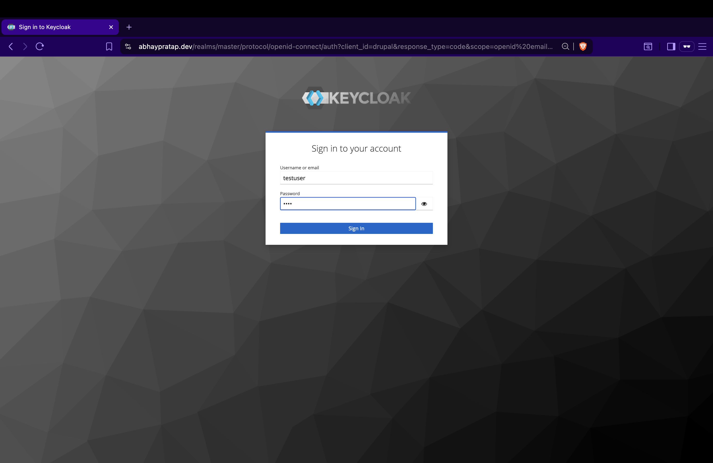
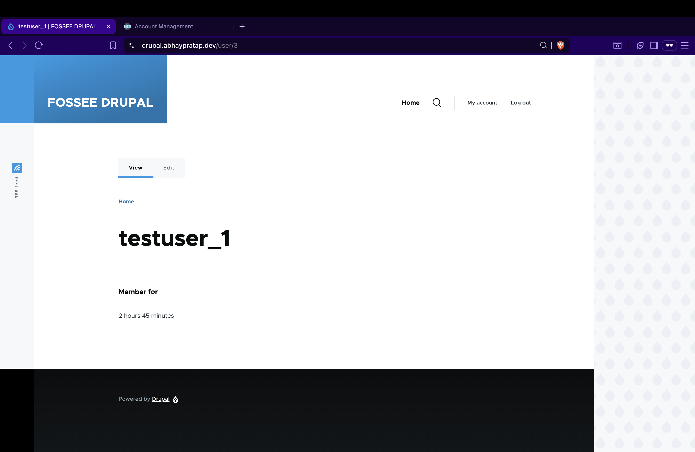

# Step 3: Drupal 11 Setup & Keycloak Integration

This document covers how to install and configure Drupal 11 on Rocky Linux 10, connect it with a MariaDB database, secure it with SSL certificates, and integrate with Keycloak SSO.

## 1. Prerequisites

- Working Apache with SSL enabled
- Certbot installed and working on server
- DNS records configured for subdomain: https://drupal.abhaypratap.dev
- Keycloak already running at https://abhaypratap.dev

## 2. Create MariaDB Database for Drupal

```sql
-- Log in to MariaDB
sudo mysql -u root -p

-- Create database and user
CREATE DATABASE drupaldb CHARACTER SET utf8mb4 COLLATE utf8mb4_unicode_ci;
CREATE USER 'drupaluser'@'localhost' IDENTIFIED BY '<confidential>';
GRANT ALL PRIVILEGES ON drupaldb.* TO 'drupaluser'@'localhost';
FLUSH PRIVILEGES;
EXIT;
```

## 3. Install Drupal

Download Keycloak and extract to /opt/keycloak

```bash
cd /var/www/
composer create-project drupal/recommended-project drupal
sudo chown -R apache:apache /var/www/drupal
sudo chmod -R 755 /var/www/drupal/web
```



## 4. Configure Apache Reverse Proxy with SSL

Create /etc/httpd/conf.d/drupal.conf

`sudo nano /etc/httpd/conf.d/drupal.conf`

```apache
<VirtualHost *:80>
    ServerName drupal.abhaypratap.dev
    DocumentRoot /var/www/drupal/web

    <Directory /var/www/drupal/web>
        AllowOverride All
        Require all granted
    </Directory>

    ErrorLog /var/log/httpd/drupal_error.log
    CustomLog /var/log/httpd/drupal_access.log combined
</VirtualHost>

<VirtualHost *:443>
    ServerName drupal.abhaypratap.dev
    DocumentRoot /var/www/drupal/web

    SSLEngine on
    SSLCertificateFile /etc/letsencrypt/live/abhaypratap.dev/fullchain.pem
    SSLCertificateKeyFile /etc/letsencrypt/live/abhaypratap.dev/privkey.pem

    <Directory /var/www/drupal/web>
        AllowOverride All
        Require all granted
    </Directory>

    ErrorLog /var/log/httpd/drupal_ssl_error.log
    CustomLog /var/log/httpd/drupal_ssl_access.log combined
</VirtualHost>
```



Restart Apache:

```bash
sudo systemctl restart httpd
```

## 5. SSL Certificates for Subdomains

Requested a multi-domain certificate with Certbot:

```bash
sudo certbot --apache \
  -d abhaypratap.dev \
  -d www.abhaypratap.dev \
  -d drupal.abhaypratap.dev \
  -d django.abhaypratap.dev \
  -d php.abhaypratap.dev
```

Check Server Status

```bash
sudo systemctl status httpd
```

Check if domain automatically redirect from HTTP to HTTPS

```bash
curl -I http://drupal.abhaypratap.dev
curl -I http://django.abhaypratap.dev
curl -I http://php.abhaypratap.dev
```



## 6. Drupal Web Installer

Navigate to `https://drupal.abhaypratap.dev` to start installation.

- Database:
  - Database name: dropaldb
  - Database user: dropaluser
  - Password: <'confidential'>



## 7. Install Keycloak Module

In the Drupal admin UI, go to Extend and enable the Keycloak module.



## 8. Configure Keycloak

- In Keycloak Admin Console:
  - Client ID: drupal
  - Root URL: `https://drupal.abhaypratap.dev`
  - Redirect URIs: `https://drupal.abhaypratap.dev/openid-connect/keycloak` (given by drupal)
  - Web Origins: `https://drupal.abhaypratap.dev`
  - Front-channel logout URL: `https://drupal.abhaypratap.dev/openid-connect/frontchannel-logout` (For Single Logout)
  - Backchannel logout URL: `https://drupal.abhaypratap.dev/openid-connect/backchannel-logout`
  - Copy Client Secret



## 9. Configure Drupal Module:

- In Drupal: Configuration -> Web services -> OPEN-ID Connect -> Keycloak
  - Client ID: drupal
  - Client Secret: <from Keycloak>
  - Keycloak Base URL: https://abhaypratap.dev/
  - Realm: master
  - Enabled features:
    - Update email address in user profile
    - Replace Drupal login with Keycloak single sign-on (SSO)
    - Enable Drupal-initiated single sign-out
    - Enable Keycloak-initiated single sign-out
    - Override registration settings
    - Save user claims on every login
  - OpenID buttons display in user login form : ABOVE



## 10. Disable Admin Approval for Registration

- In Drupal: Configuration -> People -> Settings
  - Who can register accounts?
  - Change to Visitors



## 11. Testing SSO

- Create a user in keycloak

  - username: testuser
  - password: test
  - email: test@user.com

- Go to `https://drupal.abhaypratap.dev/user/login`
- Login with keycloak
- Enter credential
- User created automatically in Drupal and activated




