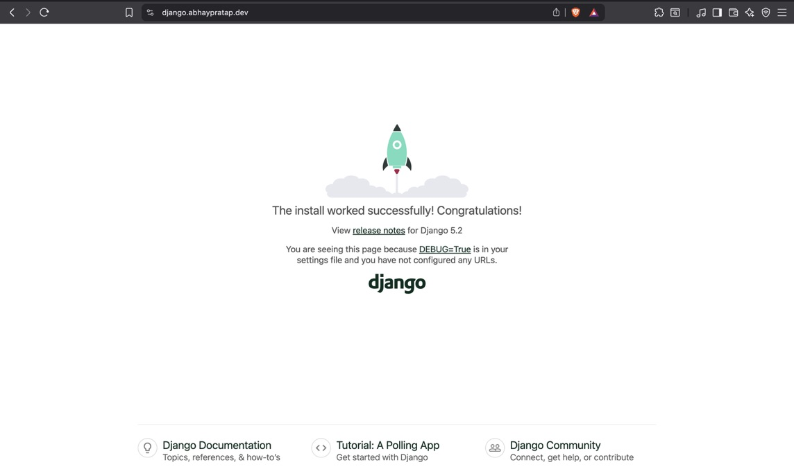
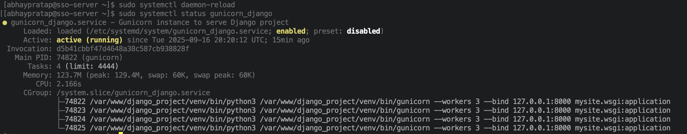
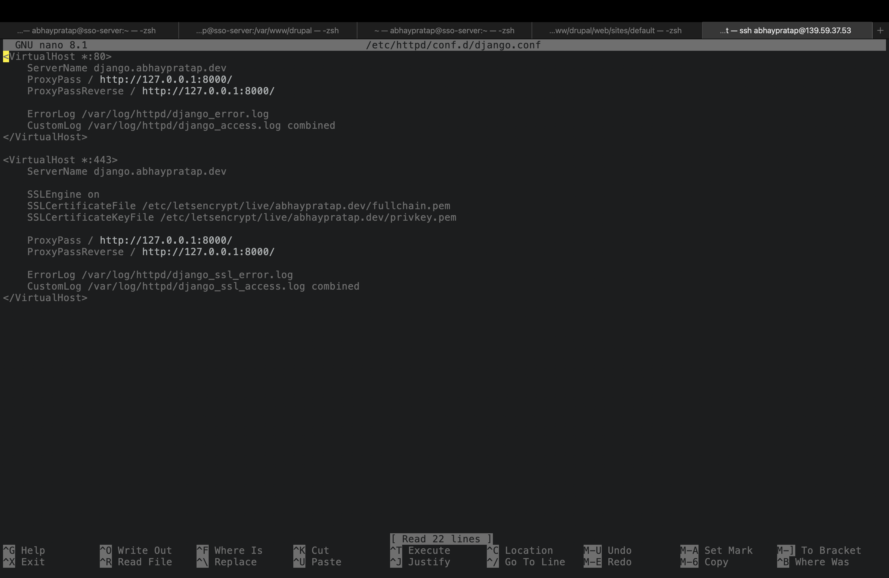
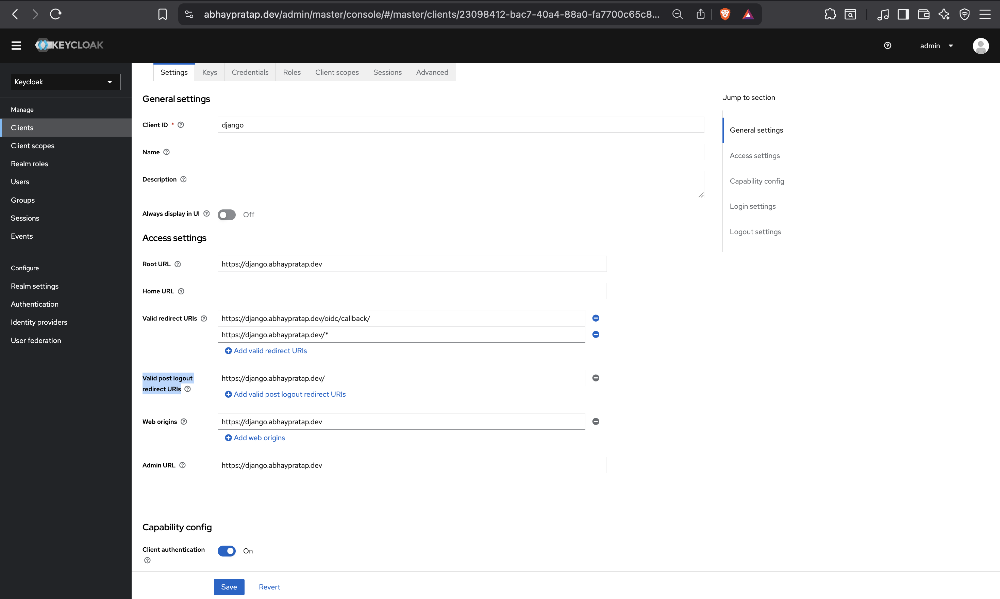
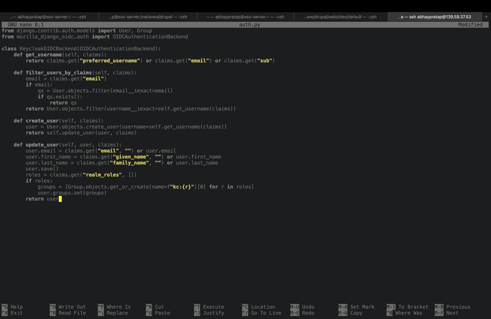
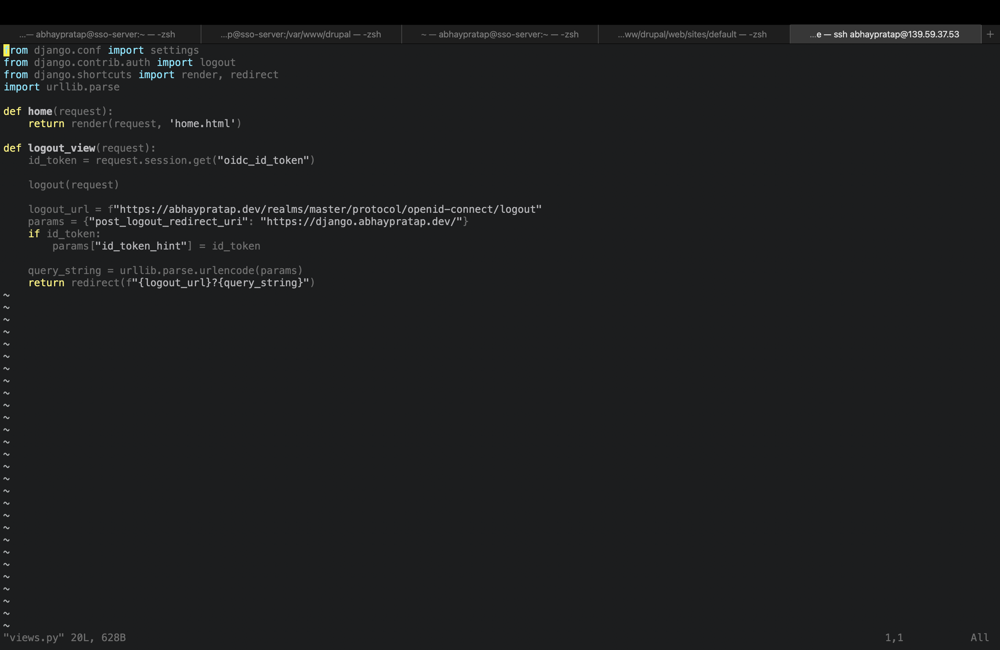
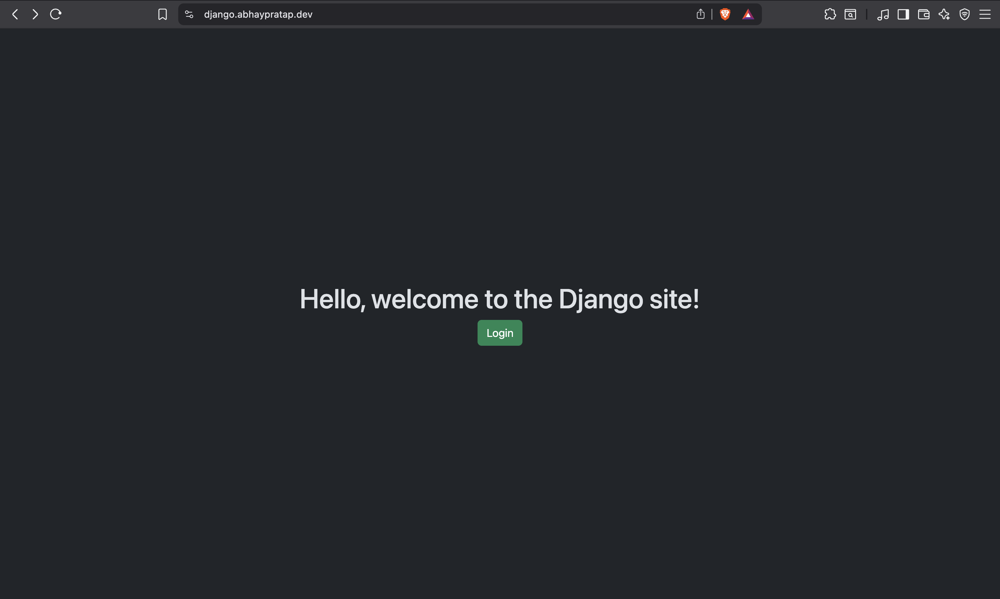
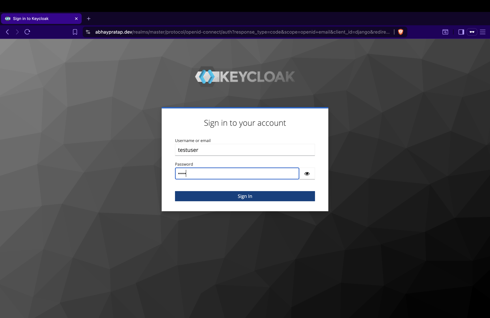
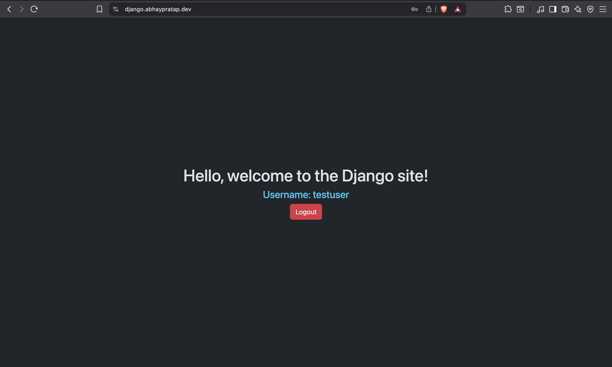

# Step 4: Django Project Setup & Keycloak SSO Integration

This document covers deploying a Django project with Keycloak Single Sign-On (SSO) on Rocky Linux 10, using Apache as a reverse proxy and MariaDB as the database.

## 1. Prerequisites

- Rocky Linux 10 server
- Apache with SSL
- DNS records configured for subdomain: https://django.abhaypratap.dev
- Keycloak already running at https://abhaypratap.dev

## 2. Create MariaDB Database for Django

```sql
-- Log in to MariaDB
sudo mysql -u root -p

-- Create database and user
CREATE DATABASE djangodb;
CREATE USER 'djangouser'@'localhost' IDENTIFIED BY '<confidential>';
GRANT ALL PRIVILEGES ON djangodb.* TO 'djangouser'@'localhost';
FLUSH PRIVILEGES;
EXIT;
```

## 3. Create Django Project

```bash
# Create project directory
sudo mkdir /var/www/django_project
sudo chown your_username:apache /var/www/django_project
cd /var/www/django_project

# Create virtual environment
python3 -m venv venv
source venv/bin/activate

# Install Django, Gunicorn, MySQL client, and OIDC library
pip install django gunicorn mozilla-django-oidc mysqlclient

# Start Django project
django-admin startproject mysite .

# after configuring MariaDB database in settings.py (see section below)
python manage.py migrate
python manage.py createsuperuser
deactivate
```



## 4. Configure Gunicorn Systemd Service

Create /etc/systemd/system/gunicorn_django.service

```ini
[Unit]
Description=Gunicorn instance to serve Django project
After=network.target

[Service]
User=your_username
Group=apache
WorkingDirectory=/var/www/django_project
Environment="PATH=/var/www/django_project/venv/bin"
ExecStart=/var/www/django_project/venv/bin/gunicorn --workers 3 --bind 127.0.0.1:8000 mysite.wsgi:application

[Install]
WantedBy=multi-user.target
```

Reload systemd and start Gunicorn:

```bash
sudo systemctl daemon-reload
sudo systemctl enable --now gunicorn_django
sudo systemctl status gunicorn_django
```



## 5. Configure Apache

Create /etc/httpd/conf.d/django.conf

```apache
<VirtualHost *:80>
    ServerName django.abhaypratap.dev
    ProxyPass / http://127.0.0.1:8000/
    ProxyPassReverse / http://127.0.0.1:8000/
    ErrorLog /var/log/httpd/django_error.log
    CustomLog /var/log/httpd/django_access.log combined
</VirtualHost>

<VirtualHost *:443>
    ServerName django.abhaypratap.dev
    SSLEngine on
    SSLCertificateFile /etc/letsencrypt/live/abhaypratap.dev/fullchain.pem
    SSLCertificateKeyFile /etc/letsencrypt/live/abhaypratap.dev/privkey.pem
    ProxyPass / http://127.0.0.1:8000/
    ProxyPassReverse / http://127.0.0.1:8000/
    ErrorLog /var/log/httpd/django_ssl_error.log
    CustomLog /var/log/httpd/django_ssl_access.log combined
</VirtualHost>
```

Restart Apache:

```bash
sudo systemctl restart httpd
```



## 6. Configure Keycloak

- In Keycloak Admin Console:
  - Client ID: django
  - Root URL: `https://django.abhaypratap.dev`
  - Redirect URIs: `https://django.abhaypratap.dev/oidc/callback/`, `https://django.abhaypratap.dev/*`
  - Valid post logout redirect URIs: `https://django.abhaypratap.dev`
  - Web Origins: `https://django.abhaypratap.dev`
  - Front-channel logout URL: `https://django.abhaypratap.dev/logout/`
  - Copy Client Secret



## 7. Configure settings.py

/var/www/django_project/mysite/settings.py

### 1. OIDC Settings

```python
INSTALLED_APPS = [
    # ...
    'mozilla_django_oidc',
]

AUTHENTICATION_BACKENDS = [
    "django.contrib.auth.backends.ModelBackend",
    "mysite.auth.KeycloakOIDCBackend",
]

OIDC_RP_CLIENT_ID = "django"
OIDC_RP_CLIENT_SECRET = "0bIqDaAJMxDPPFtAaX8fYWTWv9foK6GV"

KEYCLOAK_ISSUER = "https://abhaypratap.dev/realms/master"

OIDC_OP_AUTHORIZATION_ENDPOINT = "https://abhaypratap.dev/realms/master/protocol/openid-connect/auth"
OIDC_OP_TOKEN_ENDPOINT = "https://abhaypratap.dev/realms/master/protocol/openid-connect/token"
OIDC_OP_USER_ENDPOINT = "https://abhaypratap.dev/realms/master/protocol/openid-connect/userinfo"
OIDC_OP_JWKS_ENDPOINT = "https://abhaypratap.dev/realms/master/protocol/openid-connect/certs"

OIDC_STORE_ID_TOKEN = True
OIDC_STORE_ACCESS_TOKEN = True
OIDC_STORE_REFRESH_TOKEN = True

OIDC_RP_SIGN_ALGO = "RS256"

LOGIN_REDIRECT_URL = "/"
LOGOUT_REDIRECT_URL = "/"
```

### 2. Database Settings

```python
DATABASES = {
    'default': {
        'ENGINE': 'django.db.backends.mysql',
        'NAME': 'djangodb',
        'USER': 'djangouser',
        'PASSWORD': '<confidential>',
        'HOST': 'localhost',
        'PORT': '3306',
    }
}
```

## 8. Custom OIDC Backend

mysite/auth.py

```python
from django.contrib.auth.models import User, Group
from mozilla_django_oidc.auth import OIDCAuthenticationBackend

class KeycloakOIDCBackend(OIDCAuthenticationBackend):
    def get_username(self, claims):
        return claims.get("preferred_username") or claims.get("email") or claims.get("sub")

    def filter_users_by_claims(self, claims):
        email = claims.get("email")
        if email:
            qs = User.objects.filter(email__iexact=email)
            if qs.exists():
                return qs
        return User.objects.filter(username__iexact=self.get_username(claims))

    def create_user(self, claims):
        user = User.objects.create_user(username=self.get_username(claims))
        return self.update_user(user, claims)

    def update_user(self, user, claims):
        user.email = claims.get("email", "") or user.email
        user.first_name = claims.get("given_name", "") or user.first_name
        user.last_name = claims.get("family_name", "") or user.last_name
        user.save()
        roles = claims.get("realm_roles", [])
        if roles:
            groups = [Group.objects.get_or_create(name=f"kc:{r}")[0] for r in roles]
            user.groups.set(groups)
        return user
```



## 9. Create Views and Templates

mysite/views.py

```python
from django.contrib.auth import logout
from django.shortcuts import render, redirect
import urllib.parse
from django.conf import settings

def home(request):
    return render(request, 'home.html')

def logout_view(request):
    id_token = request.session.get("oidc_id_token")
    logout(request)
    keycloak_logout = f"{settings.KEYCLOAK_ISSUER}/protocol/openid-connect/logout"
    params = {"post_logout_redirect_uri": "https://django.abhaypratap.dev/"}
    if id_token:
        params["id_token_hint"] = id_token
    query_string = urllib.parse.urlencode(params)
    return redirect(f"{keycloak_logout}?{query_string}")
```



mysite/templates/home.html

```html
<!DOCTYPE html>
<html data-bs-theme="dark">
  <head>
    <title>Django SSO Home</title>
    <link
      href="https://cdn.jsdelivr.net/npm/bootstrap@5.3.8/dist/css/bootstrap.min.css"
      rel="stylesheet"
      integrity="sha384-sRIl4kxILFvY47J16cr9ZwB07vP4J8+LH7qKQnuqkuIAvNWLzeN8tE5YBujZqJLB"
      crossorigin="anonymous"
    />
  </head>
  <body class="d-flex flex-column min-vh-100">
    <div
      class="container d-flex flex-column justify-content-center align-items-center flex-grow-1"
    >
      <h1>Hello, welcome to the Django site!</h1>
      
      <h4 class="text-info">Username: {{ user.username }}</h4>
      <a href="" class="btn btn-danger">Logout</a>
      
      <a href="" class="btn btn-success"
        >Login</a
      >
      
    </div>
  </body>
</html>
```

## 10. Configure URLs

mysite/urls.py

```python
from django.contrib import admin
from django.urls import path, include
from . import views

urlpatterns = [
    path('admin/', admin.site.urls),
    path('oidc/', include('mozilla_django_oidc.urls')),
    path('', views.home, name='home'),
    path('logout/', views.logout_view, name='logout'),
]
```

## 11. Testing SSO

- Restart Gunicron

```bash
sudo systemctl restart gunicorn_django
```

- Go to `Visit https://django.abhaypratap.dev/`
- Click Login -> redirected to Keycloak
- Enter credential
- Redirected back to django, home page shows username and logout buttom
- Click Logout -> redirected to Keycloak logout page, then back to Django






