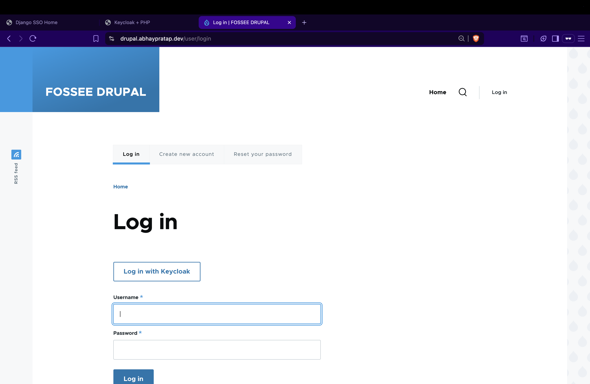
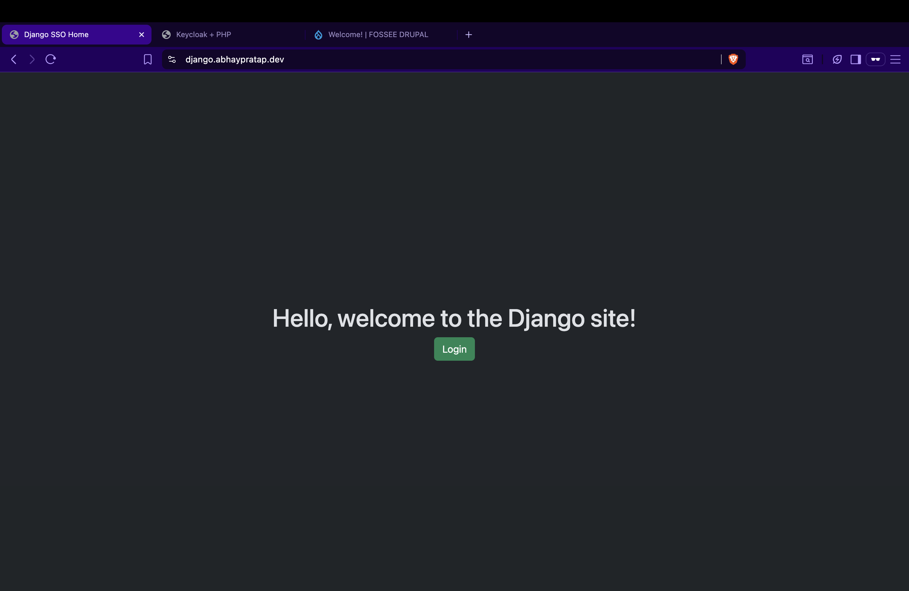
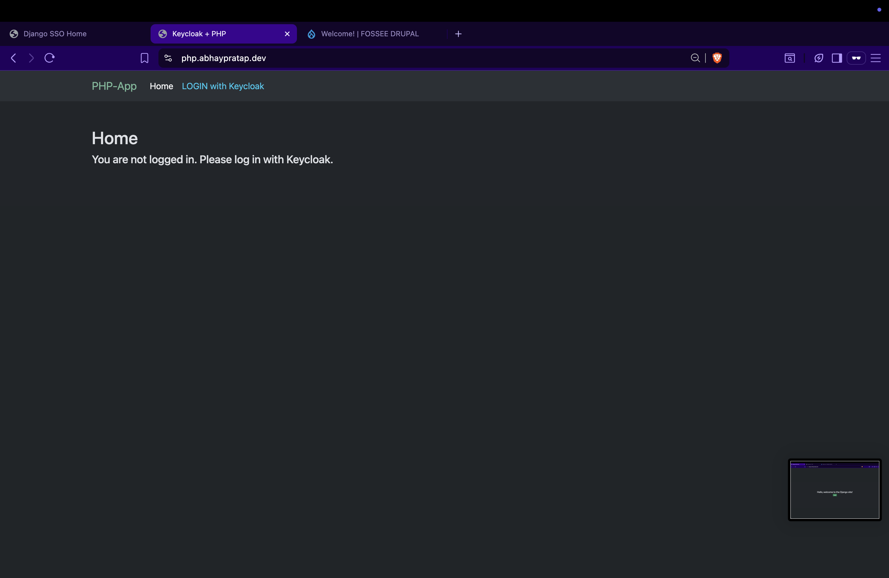
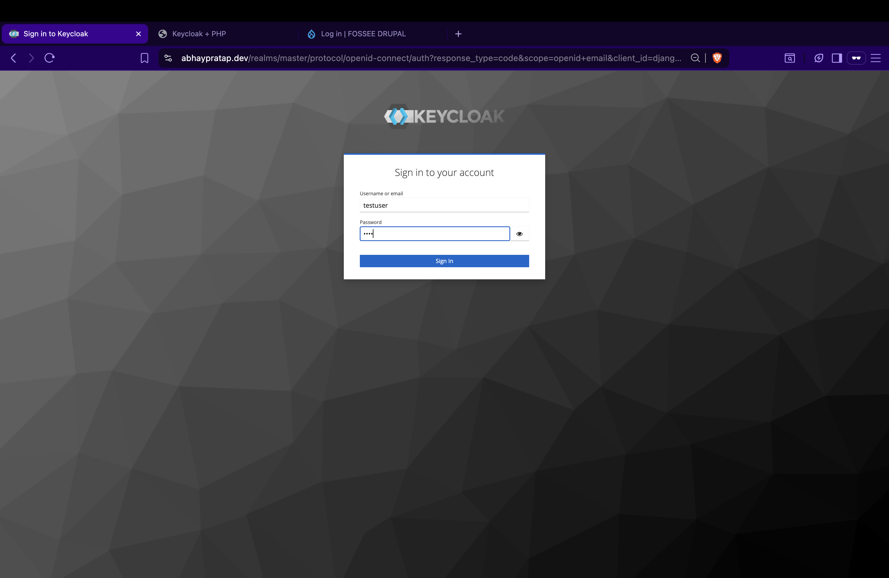
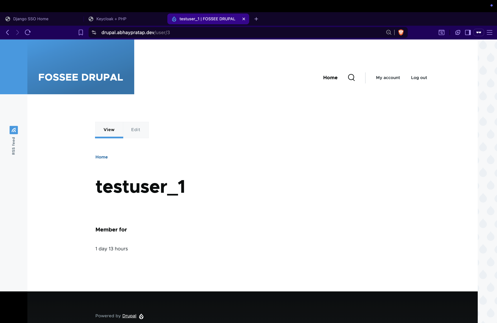
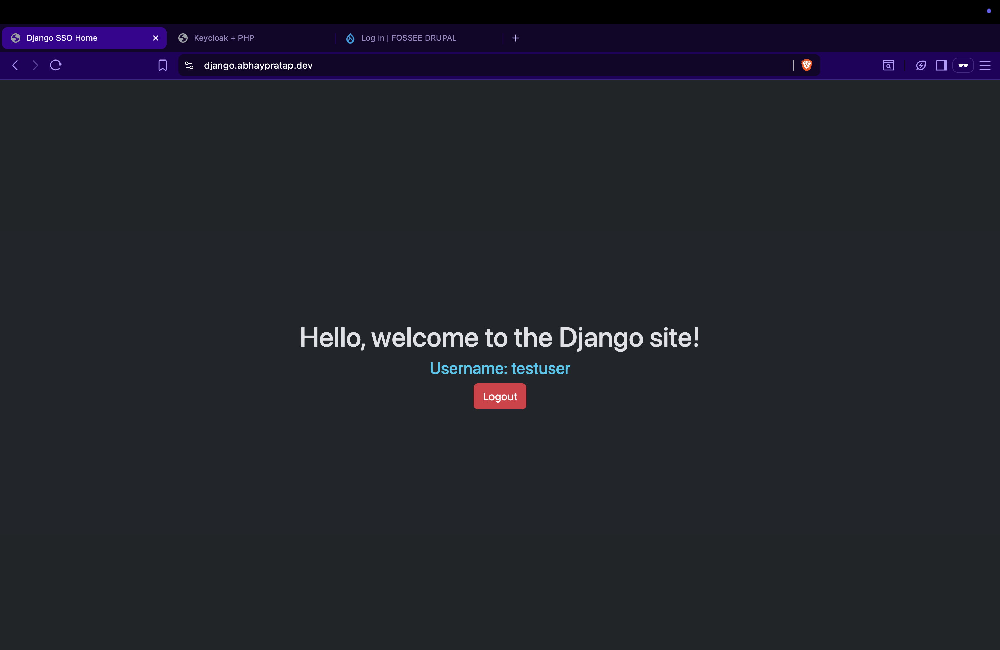
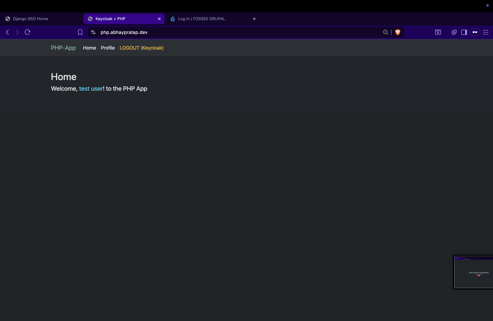

# Step 6: Testing & Validation

This document verifies the SSO integration across all applications (Drupal, Django, PHP) with Keycloak.

## 1. Prerequisites

- Keycloak running at: `https://abhaypratap.dev`
- Django app: `https://django.abhaypratap.dev`
- PHP app: `https://php.abhaypratap.dev`
- Drupal app: `https://drupal.abhaypratap.dev`
- All Keycloak clients configured with:
  - Redirect URIs
  - Post-logout redirect URIs
  - Web Origins
  - Frontchannel and Backchannel logout enabled (For Single Logout)

> **Note:** All users must have an **email address** set in Keycloak to login in Django, Drupal, and PHP applications.

## 2. Login Flow

1. Open `https://drupal.abhaypratap.dev`

   - Click Login with Keycloak
   - Redirects to Keycloak
   - Enter Credentials (e.g., username: testuser, pass: test)
   - Redirect back to Drupal with logged-in session

2. Open `https://django.abhaypratap.dev`

   - Click Login
   - Redirects to Keycloak
   - Enter Credentials
   - Redirect back to Django, username shown

3. Open `https://php.abhaypratap.dev`
   - Click Login
   - Redirects to Keycloak
   - Enter Credentials
   - Redirect back to PHP home page

## 3. Single Sign-On (SSO) Flow

- Login once in **Keycloak** through any app
- Access all 3 apps without re-authentication.
- SSO session sharing confirmed.

## 4. Single Logout (SLO) Flow

- Logout from anyone of the app (e.g, Django) -> Redirects to Keycloak -> Session terminated.
- Other apps (Drupal, PHP, Django) automatically gets logged out.
- Verified that logging out from any one app logs out all apps. (SLO enabled)

## 5. Screenshots

## Conclusion:

Keycloak SSO works seamlessly across **Drupal, Django, and PHP**, with consistent login and logout.
